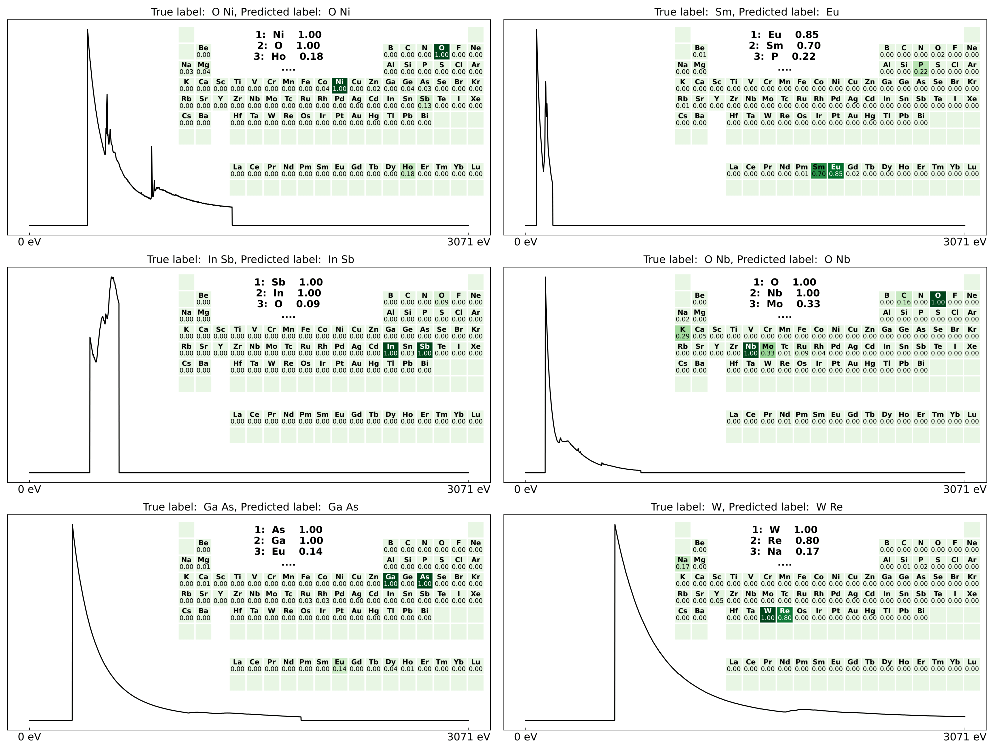

# EELS ID
Electron energy loss spectroscopy identification (EELS ID) is a deep learning tool for automated element identification in core-loss EELS spectra. A series of neural networks are trained on simulated data to identify the following elements based on their respective edges. This repo shares some minimal examples on how to train and evaluate models with simulated EELS data and how to use the trained models to automate element identification.

<p align="center">
  
</p>


## Use 
Tensorflow is required. Installation instructions can be found [here](https://www.tensorflow.org/install). GPU support is not required but strongly recommended. For apple silicon look [here](https://developer.apple.com/metal/tensorflow-plugin/) for an installation with GPU support. To avoid the requirement for local GPU support, one could use a google colab notebook coupled with google drive by using something like
```python
from google.colab import files
from google.colab import drive
drive.mount('gdrive', force_remount=True)

!unzip gdrive/My\ Drive/trained element identification models.zip 
!unzip gdrive/My\ Drive/Core-loss EELS TFRecord.zip 
```
[Hyperspy](https://hyperspy.org) is required for STEM-EELS spectrum images (SI) processing.
### accessing data
All simulated data can be downloaded from Zenodo ([here](https://zenodo.org/record/8004912)) in HDF5 format. A script for transforming the HDF5 format to TFRecord format is in the IO_help folder.
### accessing trained models
Trained models (Vision transformer, UNet and ensemble of 2 ViTs + 3 UNets) are also available in the Zenodo publication ([here](https://zenodo.org/record/8004912)).
### automated element identification
EELS ID can be used to perform element identification on individual experimental core-loss EELS spectra:

Or it can be used to perform automated element identification in spectrum images, like demonstrated for this LMO/BTO/STO superlattice adapted from Chen, B., Gauquelin, N., Strkalj, N. et al. Nat Commun 13, 265 (2022). [10.1038/s41467-021-27898-x](https://doi.org/10.1038/s41467-021-27898-x)

<p align="center">
  
</p>

## Scores
The models were evaluated on experimental EELS spectra, resulting in the following scores

|Model | F1-score| Precision | Recall| Exact match ratio | Threshold | 
|------------ | ------------| ------------| ------------| ------------| ------------|
|UNet | 0.84 | 0.86 | 0.86 | 0.62 | 0.95 | 
|ViT | 0.84 | 0.86 | 0.86 | 0.60 | 0.80 |
|2ViT+3UNet ensemble | 0.86 | 0.88 | 0.88 | 0.70 | 0.75 |

## Citation


If you use EELS ID in your work, please cite

Annys, A., Jannis, D. & Verbeeck, J. Deep learning for automated materials characterisation in core-loss electron energy loss spectroscopy. Sci Rep 13, 13724 (2023). https://doi.org/10.1038/s41598-023-40943-7
